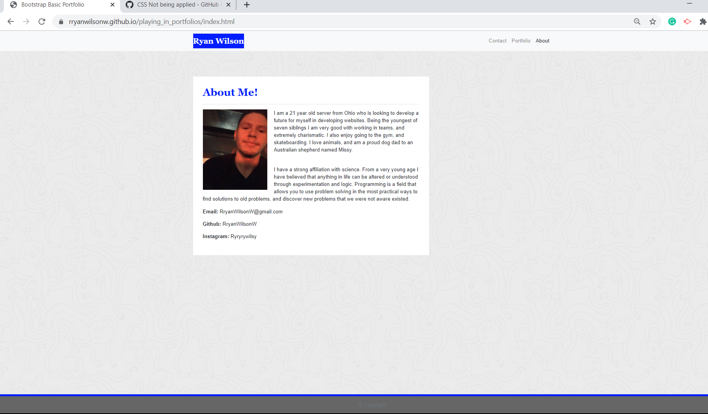
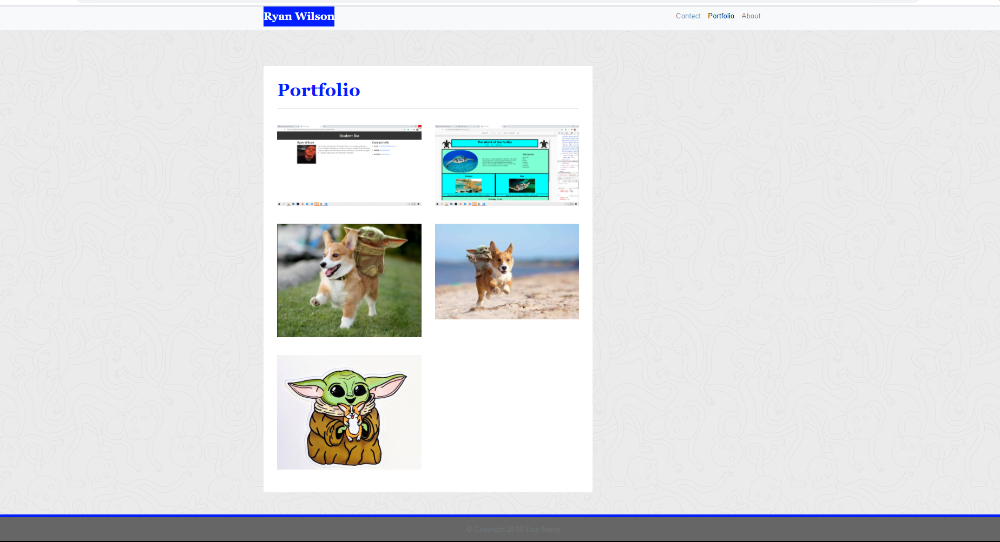
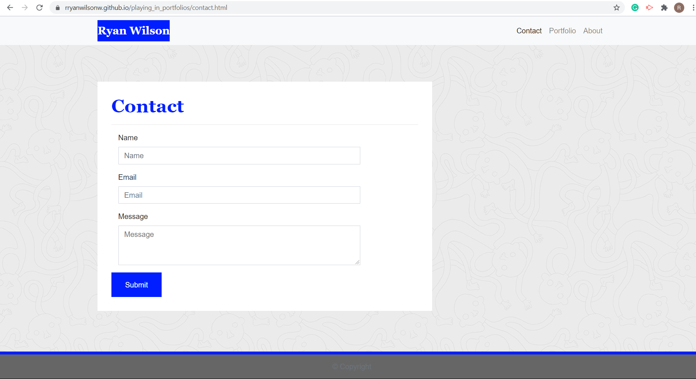

# About the page. #
This is a responsive website developed using HTML 5 and CSS3. The main purpose of the website is to give the user information about myself, and a way to contact me.The website utilizes styling from bootstrap for positioning.

# Link to Website #
https://rryanwilsonw.github.io/playing_in_portfolios/

# Screenshots of website #

# Header. #
The header of each page is the same, giving the website a form of concurrent display. Inside of the header contains a nav with the links that can take you from page to page. 

# About me #
This is the section where the about me page begins to diversify. Using a class of container on the main element allows bootstrap to know that it will be positioning everything contained inside. Adding a class of rows to the section on line 51 tells bootstrap that everything in that section is going to be in a single row. Then using col-md-8 we are telling bootstrap that we only want the content to take up eight out of twelve rows. The article with a class of block is a semantic tag for the browser pulling in css to put the information in a block. This form of positioning is ideal because it makes the website responsive, without the need of too many media queries. The first two p tags are information about myself, while the last three are ways of contacting me. 

# Portfolio #
This page is designed to showcase the work that I have done. It does this by containing screenshots of some of my course work. Due to a lack of work, I had to fill in some of the spaces with pictures of baby yoda. Similar to the about me page, the elements are positioned using rows and columns. The difference in this one is that there are multiple rows containing multiple columns. This gives the page almost a grid feel. 

# Contact #
This page contains a form that is used to collect information from an individual who may be interested in reaching out to me. The form contains three text boxes where the user can type in their name, email, and a message. At the bottom of the form there is a submit button used to submit the document. The entire section is made to encompass 8 columns. From there each identifier for the text input is made to take up 2 columns, and their corresponding text document is made to take up 10 columns. The submit button is using external styling and programming to give it function. 

# footer # 
The footer element is stationary on every screen, with styling to center it, and give it color and font.

# CSS #
All three pages are connected to a single css file, that is capable of styling all of them. The mixture of css from an external file, and the CSS from bootstrap are capable of working together to properly manipulate the elements in a practical and fine tuned way.

At the bottom of each HTML document are links to a jQuery and Javascript repository.
